```markdown
# 🤖 AI-SRE

> **Autonomous Kubernetes Incident Investigation & Self-Healing Platform**

An AI-powered Site Reliability Engineering (SRE) platform that autonomously investigates Kubernetes incidents, identifies root causes using LLMs, generates explainable remediation plans, safely executes approved recovery actions, verifies cluster health, and continuously learns from previous incidents.

<p align="center">


</p>

---

# 🚀 Overview

Modern Kubernetes clusters generate enormous amounts of operational data:

- Events
- Logs
- Metrics
- Deployment revisions
- ReplicaSets
- Pods
- Node status
- Network state

Although Kubernetes is excellent at self-healing infrastructure, it does **not explain why failures occur** or determine the safest recovery strategy.

Engineers still spend valuable time manually:

- Inspecting events
- Reading logs
- Correlating metrics
- Identifying root causes
- Selecting recovery actions
- Verifying deployments

AI-SRE automates this investigation workflow while keeping humans in control of high-risk decisions.

---

# 🎯 Vision

AI-SRE aims to become an intelligent Site Reliability Engineer capable of:

- Understanding Kubernetes incidents
- Reasoning over operational evidence
- Producing explainable diagnoses
- Generating remediation plans
- Executing approved recovery actions
- Learning from previous incidents

Rather than replacing SREs, AI-SRE augments operational teams by reducing repetitive investigation effort and accelerating production incident resolution.

---

# ❗ Problem Statement

Traditional observability platforms answer:

> **What is failing?**

Production engineers actually need answers to questions like:

- Why is this Pod restarting?
- Why did the rollout fail?
- Is Kubernetes healthy?
- Is the application unhealthy?
- Which remediation is safest?
- Has this happened before?
- Can the recovery be automated?

Existing monitoring tools expose telemetry but leave diagnosis and decision-making entirely to operators.

AI-SRE fills this gap by transforming raw operational data into actionable operational intelligence.

---

# 💡 Solution

AI-SRE combines deterministic Kubernetes tooling with Large Language Models to build an end-to-end autonomous incident response pipeline.

Instead of executing static automation scripts, the platform:

1. Collects only relevant operational evidence.
2. Selects an investigation strategy.
3. Performs adaptive evidence collection.
4. Determines the most probable root cause.
5. Generates explainable remediation plans.
6. Evaluates operational risk.
7. Requests approval when required.
8. Executes approved remediation.
9. Verifies deployment recovery.
10. Stores investigation history for future learning.

This architecture enables safe automation while maintaining complete auditability.

---

# ✨ Core Capabilities

| Capability | Description |
|------------|-------------|
| 🔍 Adaptive Investigation | Collects only incident-specific evidence |
| 🧠 Root Cause Analysis | LLM-powered reasoning across Kubernetes evidence |
| 📋 Remediation Planning | Generates explainable recovery plans |
| ⚠️ Risk Assessment | Evaluates operational impact before execution |
| 👨‍💻 Human Approval | High-risk actions require operator approval |
| ⚡ Automated Recovery | Executes approved remediation safely |
| ✅ Verification | Confirms deployment health after execution |
| 📚 Incident Memory | Learns from historical investigations |
| 🌍 Multi-Cluster Support | Independent investigations across Kubernetes clusters |

---

# ⭐ Key Features

## 🔍 Adaptive Evidence Collection

Instead of collecting every Kubernetes resource, AI-SRE dynamically selects evidence based on the detected incident.

Supported incident categories include:

- CrashLoopBackOff
- OOMKilled
- Pending Pods
- ImagePullBackOff
- Failed Readiness Probes
- Failed Liveness Probes
- DNS Issues
- Storage Failures
- API Server Failures
- etcd Issues

---

## 🧠 Explainable Root Cause Analysis

AI-SRE combines:

- Kubernetes resources
- Cluster events
- Application logs
- Prometheus metrics
- Historical incidents
- Investigation playbooks

to identify:

- Root cause
- Supporting evidence
- Confidence score
- Operational explanation

---

## 📋 Intelligent Planning

Each remediation contains:

- Recommended actions
- kubectl commands
- Operational reasoning
- Estimated impact
- Rollback strategy
- Risk level

Every recommendation is fully explainable before execution.

---

## 🛡 Human-in-the-Loop Automation

Low-risk actions execute automatically.

Examples:

- Restart Deployment
- Delete failed Pod
- Scale replicas

High-risk actions require approval.

Examples:

- Modify Deployments
- Update ConfigMaps
- Rotate Secrets
- Delete resources
- Rollback production releases

---

## ⚡ Automated Verification

Recovery is not considered successful until AI-SRE verifies:

- Deployment rollout
- Replica availability
- Pod readiness
- Container health
- Probe status
- CrashLoopBackOff recurrence

---

## 📚 Persistent Incident Memory

Every investigation stores:

- Evidence
- Diagnosis
- Planning
- Execution
- Verification
- Final report

Future investigations can reuse previous operational knowledge.

---

# 🏛 Design Principles

AI-SRE follows six core principles.

| Principle | Description |
|-----------|-------------|
| Explainability | Every decision includes supporting evidence |
| Safety | High-risk actions always require approval |
| Modularity | Independent agents with single responsibilities |
| Extensibility | New collectors and playbooks are easily added |
| Auditability | Every operation is permanently recorded |
| Cloud Native | Built around Kubernetes-first design |

---

# 🛠 Technology Stack

| Layer | Technology |
|--------|------------|
| Frontend | React |
| Backend | FastAPI |
| Workflow Engine | LangGraph |
| AI Framework | LangChain |
| LLM | Configurable Provider |
| Database | PostgreSQL |
| Monitoring | Prometheus |
| Cluster API | Kubernetes Python Client |
| Containers | Docker |
| Deployment | Kubernetes |

---

# 📊 Project Highlights

- ✅ Agentic AI Architecture
- ✅ Kubernetes-Native Design
- ✅ Adaptive Investigation Workflow
- ✅ Multi-Agent Reasoning
- ✅ Human-in-the-Loop Safety
- ✅ Explainable AI Decisions
- ✅ Multi-Cluster Ready
- ✅ Extensible Playbook Engine
- ✅ Production-Oriented Architecture
- ✅ Designed for Cloud-Native SRE

---

> 📖 Continue to **Part 2 — System Architecture**, where we explore the overall architecture, Mermaid diagrams, LangGraph orchestration, and the complete incident lifecycle.
```

````markdown
# 🏗️ System Architecture

AI-SRE follows a modular, agent-based architecture that separates **investigation**, **decision making**, **execution**, and **verification**.

Instead of relying on static automation scripts, AI-SRE models incident response as a **stateful graph** using **LangGraph**, allowing the system to adapt its investigation based on the evidence collected.

---

# Design Philosophy

The architecture is built around one simple principle:

> **Think before you act.**

Traditional automation systems often execute predefined commands immediately after detecting an alert.

AI-SRE instead follows this sequence:

1. Understand the incident
2. Collect evidence
3. Reason about the evidence
4. Generate a remediation plan
5. Evaluate operational risk
6. Obtain approval (if required)
7. Execute the remediation
8. Verify recovery
9. Learn from the incident

This separation dramatically improves safety, explainability, and auditability.

---

# High-Level Architecture

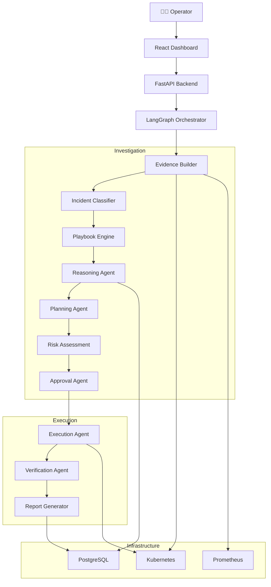

---

# Component Responsibilities

| Component | Responsibility |
|------------|----------------|
| React | Operator dashboard |
| FastAPI | REST API and orchestration entry point |
| LangGraph | Workflow orchestration |
| Evidence Builder | Collects Kubernetes evidence |
| Incident Classifier | Detects incident category |
| Playbook Engine | Chooses investigation strategy |
| Reasoning Agent | Determines root cause |
| Planning Agent | Generates remediation |
| Risk Assessment | Evaluates operational impact |
| Approval Agent | Determines execution policy |
| Execution Agent | Executes Kubernetes operations |
| Verification Agent | Confirms successful recovery |
| PostgreSQL | Stores investigations and execution history |

---

# Layered Architecture

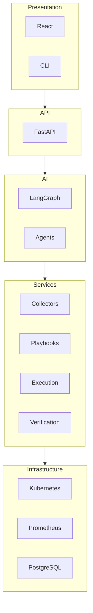

---

# Incident Lifecycle

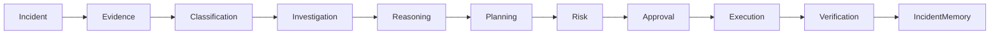

Every incident follows the same high-level lifecycle, while the internal investigation adapts depending on the incident type.

---

# Investigation vs Execution

One of AI-SRE's core design decisions is separating investigation from execution.

| Investigation | Execution |
|---------------|-----------|
| Read-only | Read & Write |
| Builds evidence | Applies remediation |
| Uses AI reasoning | Uses deterministic tooling |
| No cluster modifications | Modifies Kubernetes resources |
| Produces remediation plan | Executes approved plan |
| Safe to rerun | Requires safeguards |

This separation ensures that diagnosis can be repeated without affecting production systems.

---

# Data Flow

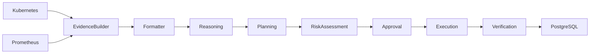

---

# Agent Collaboration

Unlike traditional automation systems where a single component performs every task, AI-SRE assigns one responsibility to each agent.

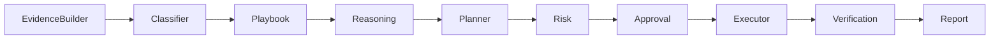

Each agent receives structured input from the previous stage and produces structured output for the next stage.

This modular architecture makes the platform easier to maintain, test, and extend.

---

# Why LangGraph?

LangGraph is used because incident response is **stateful**.

Production investigations require:

- Conditional execution
- Retry logic
- Human approval
- Dynamic evidence collection
- Persistent state
- Long-running workflows

A graph-based workflow engine naturally models these requirements better than linear pipelines.

---

# External Integrations

| System | Purpose |
|---------|----------|
| Kubernetes API | Cluster state and execution |
| Prometheus | Metrics collection |
| PostgreSQL | Investigation persistence |
| Docker | Containerization |
| React | User interface |

---

# What's Next?

The next document explains the complete investigation pipeline in detail.

➡️ **Continue with:** `docs/investigation.md`
````

````markdown
# 🔍 Investigation Workflow

The Investigation Workflow is the intelligence core of AI-SRE.

Unlike traditional monitoring systems that simply collect metrics or trigger alerts, AI-SRE actively investigates production incidents by gathering evidence, selecting an appropriate investigation strategy, reasoning over the collected information, and generating an explainable remediation plan.

> **This workflow never modifies the Kubernetes cluster.**
>
> Its sole responsibility is to understand the incident and recommend the safest recovery strategy.

---

# Investigation Goals

Every investigation attempts to answer five questions:

1. **What happened?**
2. **Why did it happen?**
3. **How confident are we?**
4. **What should be done?**
5. **Is the proposed action safe?**

Only after these questions are answered does AI-SRE proceed to execution.

---

# Complete Investigation Pipeline

```mermaid
flowchart LR

START([Incident])

A[Load Incident Context]

B[Evidence Builder]

C[Incident Classifier]

D[Playbook Engine]

E[Adaptive Evidence Collection]

F[Evidence Formatter]

G[Reasoning Agent]

H[Planning Agent]

I[Risk Assessment]

J[Approval Decision]

K[Persist Investigation]

END([Execution Workflow])

START --> A
A --> B
B --> C
C --> D
D --> E
E --> F
F --> G
G --> H
H --> I
I --> J
J --> K
K --> END
```

---

# Investigation State

Throughout the workflow, LangGraph maintains a shared investigation state.

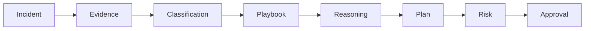

Each agent reads from the shared state, enriches it, and passes it to the next stage.

This approach eliminates duplicated API calls and enables stateful reasoning across the entire investigation.

---

# Stage 1 — Load Incident Context

Every investigation begins with a minimal incident description.

Typical inputs include:

- Cluster name
- Namespace
- Deployment
- Pod
- Alert source
- Incident timestamp

Example:

```yaml
cluster: production
namespace: payments
deployment: payment-service
pod: payment-service-54db8
incident_type: CrashLoopBackOff
```

The investigation context uniquely identifies the affected workload before evidence collection begins.

---

# Stage 2 — Evidence Builder

The Evidence Builder is responsible for constructing an operational snapshot of the affected workload.

It acts as the primary interface between AI-SRE and Kubernetes.

Initially, only lightweight evidence is collected.

Examples include:

- Pod
- Deployment
- ReplicaSet
- Namespace
- Events
- Labels
- Annotations
- Container status

The purpose of this stage is to provide enough information for incident classification without collecting unnecessary resources.

---

## Evidence Builder Architecture

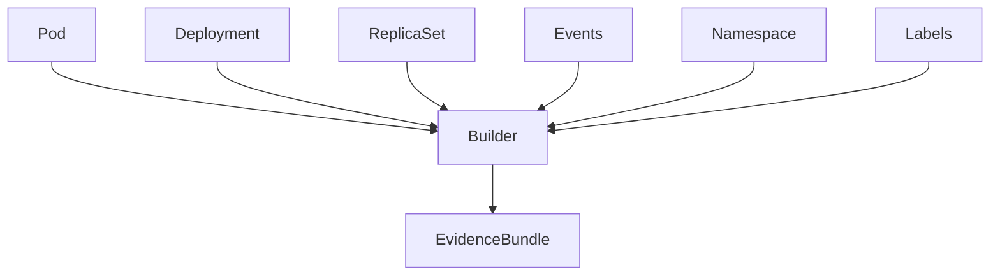

The output of this stage is a structured evidence bundle shared with downstream agents.

---

# Stage 3 — Incident Classification

Not every incident should follow the same investigation strategy.

AI-SRE first determines the most probable failure category.

Supported categories include:

| Incident | Description |
|-----------|-------------|
| CrashLoopBackOff | Repeated container crashes |
| OOMKilled | Memory exhaustion |
| Pending Pods | Scheduling failures |
| ImagePullBackOff | Image retrieval failure |
| Failed Readiness Probe | Service unavailable |
| Failed Liveness Probe | Container restart loop |
| DNS Failure | Cluster DNS issues |
| Storage Failure | Persistent volume problems |
| API Server Failure | Kubernetes control plane |
| etcd Failure | Cluster state issues |

Incident classification determines which playbook should be executed.

---

# Stage 4 — Playbook Engine

Each incident category has its own investigation strategy.

Instead of collecting every Kubernetes resource, AI-SRE only gathers information relevant to the detected incident.

For example:

## CrashLoopBackOff

Collect:

- Previous logs
- Restart history
- Exit code
- Probe configuration
- ReplicaSet history

---

## Pending Pods

Collect:

- Scheduler events
- Node capacity
- Taints
- Tolerations
- Affinity
- Resource availability

---

## OOMKilled

Collect:

- Memory limits
- Memory requests
- Prometheus memory metrics
- Previous OOM events

---

## DNS Failure

Collect:

- CoreDNS logs
- Services
- Endpoints
- Network policies
- DNS configuration

---

# Playbook Selection

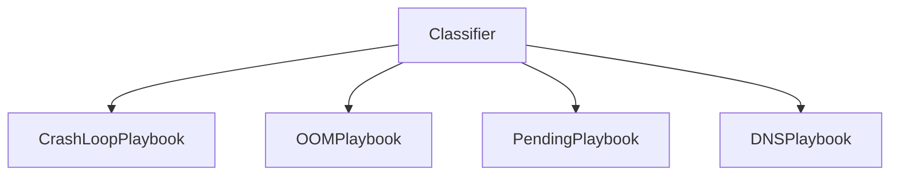

This design makes AI-SRE highly extensible.

Adding support for a new incident only requires implementing a new playbook.

---

# Stage 5 — Adaptive Evidence Collection

One of AI-SRE's key innovations is adaptive investigation.

Instead of collecting everything up front, the Reasoning Agent determines whether additional evidence is required.

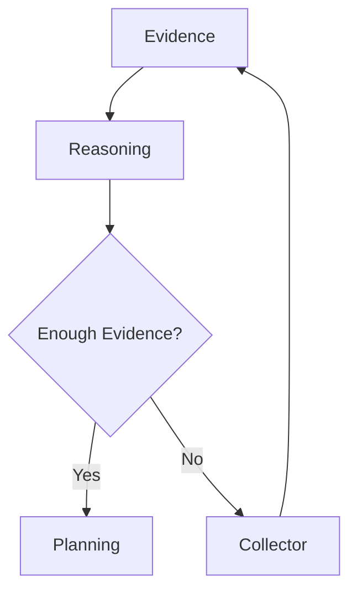

This dramatically reduces:

- Kubernetes API calls
- Prompt size
- Investigation latency

while improving reasoning quality.

---

# Stage 6 — Evidence Formatter

Raw Kubernetes objects contain a significant amount of metadata that is irrelevant for AI reasoning.

The formatter transforms collected resources into compact, structured documents.

Responsibilities include:

- Removing unnecessary metadata
- Normalizing Kubernetes resources
- Preserving operational context
- Compressing prompt size
- Standardizing collector output

The result is optimized for LLM consumption.

---

# Investigation Artifacts

Each completed investigation produces:

| Artifact | Purpose |
|-----------|----------|
| Evidence Bundle | Operational snapshot |
| Incident Classification | Failure category |
| Investigation Playbook | Collection strategy |
| Root Cause | Diagnosis |
| Confidence Score | AI certainty |
| Remediation Plan | Recovery strategy |
| Risk Level | Execution safety |

These artifacts are persisted and reused during future investigations.

---

# Why Adaptive Investigation?

Traditional systems often collect every available metric regardless of relevance.

AI-SRE instead behaves like an experienced SRE:

1. Gather initial evidence.
2. Form a hypothesis.
3. Request additional evidence only if required.
4. Refine the hypothesis.
5. Produce a diagnosis.

This mirrors how human operators investigate complex production incidents while minimizing unnecessary API calls and reducing reasoning latency.

---

# What's Next?

Once the investigation produces a validated remediation plan, control passes to the **Execution Workflow**, where AI-SRE safely applies the approved recovery actions and verifies that the cluster has returned to a healthy state.

➡️ **Continue with:** `docs/execution.md`
````

````markdown
# ⚙️ Execution Workflow

The Investigation Workflow determines **what should be done**.

The Execution Workflow determines **how it should be done safely**.

Unlike investigation, execution directly interacts with the Kubernetes cluster by applying approved remediation plans, verifying system health, and recording every action for auditing.

---

# Execution Philosophy

AI-SRE follows one fundamental rule:

> **Never execute before understanding.**

Every execution originates from a completed investigation.

This guarantees that remediation is:

- Explainable
- Auditable
- Risk Assessed
- Approved (when required)
- Verifiable

---

# Complete Execution Pipeline

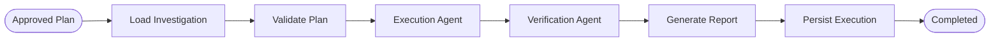

---

# Execution Responsibilities

The execution workflow performs five major tasks.

| Stage | Responsibility |
|--------|----------------|
| Validation | Verify remediation plan integrity |
| Execution | Apply Kubernetes operations |
| Verification | Confirm cluster recovery |
| Reporting | Generate execution summary |
| Persistence | Store execution history |

---

# Loading the Investigation

Execution begins by loading the completed investigation.

The workflow retrieves:

- Incident details
- Root cause
- Evidence bundle
- Approved remediation plan
- Risk level
- Approval status

Execution never performs additional reasoning.

It strictly follows the approved plan.

---

# Plan Validation

Before executing any action, AI-SRE validates the remediation plan.

Validation includes:

- Cluster exists
- Namespace exists
- Deployment exists
- Required permissions available
- Target resources reachable
- Plan not expired

If validation fails, execution terminates immediately.

---

# Validation Workflow

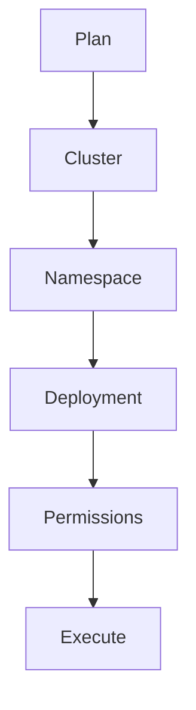

---

# Execution Agent

The Execution Agent applies remediation actions using deterministic Kubernetes tooling.

Typical operations include:

- Restart Deployment
- Scale Deployment
- Delete Pod
- Rollout Restart
- Rollback Deployment
- Patch Resources
- Restart StatefulSet

Every action is executed independently.

If any step fails, execution stops immediately.

---

# Execution State Machine

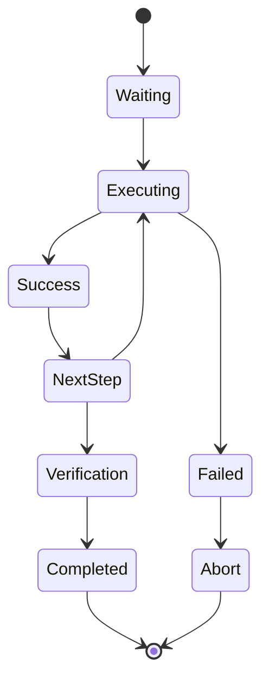

---

# Kubernetes Tool Layer

The Execution Agent never invokes shell commands directly.

Instead, every operation passes through a dedicated Kubernetes Tool Layer.

Responsibilities include:

- Loading kubeconfig
- Selecting target cluster
- Executing Kubernetes API calls
- Capturing responses
- Handling retries
- Recording execution metadata

This abstraction simplifies testing while supporting multiple clusters.

---

# Tool Architecture

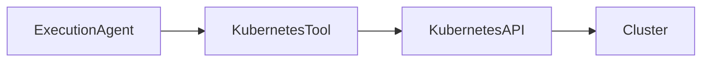

---

# Risk Assessment

Every remediation plan includes a predefined risk level.

| Risk | Examples | Behaviour |
|------|----------|-----------|
| Low | Restart Pod | Execute Automatically |
| Medium | Scale Deployment | Optional Approval |
| High | Rollback Production | Mandatory Approval |
| Critical | Delete Resources | Explicit Human Confirmation |

Execution never bypasses the assigned policy.

---

# Approval Workflow

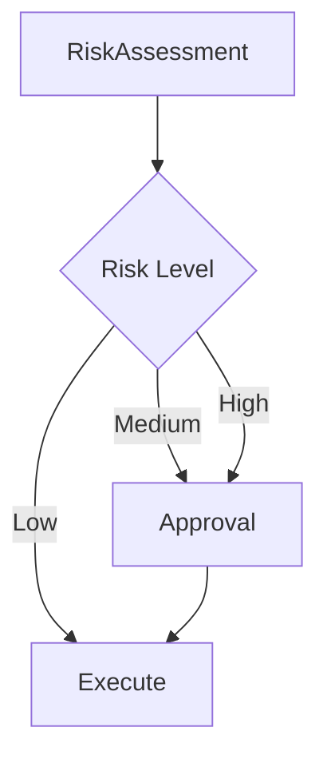

---

# Verification Agent

Successful command execution does **not** guarantee incident resolution.

The Verification Agent continuously evaluates deployment health until either:

- Recovery succeeds
- Retry limit exceeded

---

# Verification Checks

The Verification Agent validates:

- Deployment Available
- Desired Replicas
- Updated Replicas
- Ready Pods
- Running Containers
- Probe Status
- CrashLoopBackOff
- Pending Pods
- Rollout Status

Only when all required checks pass is the incident considered resolved.

---

# Verification Workflow

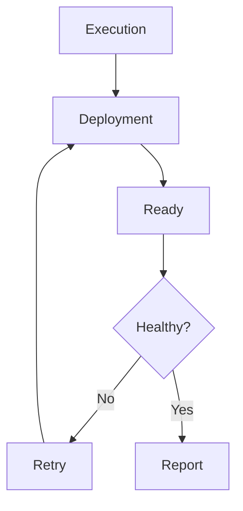

---

# Retry Strategy

Production deployments require time to stabilize.

Instead of failing immediately, AI-SRE retries verification.

Typical retry policy:

| Property | Example |
|-----------|---------|
| Attempts | 5 |
| Delay | 15 seconds |
| Strategy | Exponential Backoff |

This prevents false failures during rolling deployments.

---

# Rollback Support

If execution fails midway, AI-SRE can trigger rollback procedures.

Rollback strategies include:

- Deployment Rollback
- Restore Previous Replica Count
- Restore Previous Image
- Restore Previous Configuration

Rollback support depends on the remediation type.

---

# Execution Report

Every execution generates a structured report.

## Incident

- Cluster
- Namespace
- Deployment
- Incident Type

---

## Root Cause

The diagnosis produced during investigation.

---

## Actions

- Commands Executed
- Execution Duration
- Success / Failure
- Rollback Performed

---

## Verification

- Health Status
- Verification Attempts
- Final Result

---

## Summary

A human-readable operational explanation describing:

- What happened
- Why it happened
- What was executed
- Whether recovery succeeded
- Remaining recommendations

---

# Persistence

Execution history is permanently stored.

Stored information includes:

- Investigation ID
- Execution ID
- Commands Executed
- Verification Results
- Operator Approval
- Rollback Information
- Execution Duration
- Final Outcome

This enables complete operational auditing.

---

# Multi-Cluster Execution

Each execution is isolated to the originating cluster.

The Execution Agent automatically loads:

- Correct kubeconfig
- Cluster credentials
- Namespace
- Context

This prevents accidental cross-cluster operations.

---

# Safety Guarantees

AI-SRE enforces several safety mechanisms before modifying production systems.

✅ Approved remediation only

✅ Risk-based execution

✅ Human approval

✅ Verification after execution

✅ Automatic auditing

✅ Complete execution history

---

# What's Next?

The next document explains the internal AI agents that power AI-SRE, including:

- Evidence Builder
- Incident Classifier
- Reasoning Agent
- Planning Agent
- Risk Assessment Agent
- Approval Agent
- Execution Agent
- Verification Agent

➡️ Continue with **`docs/agents.md`**
````
