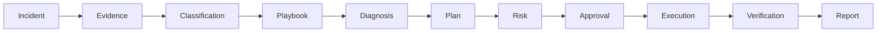
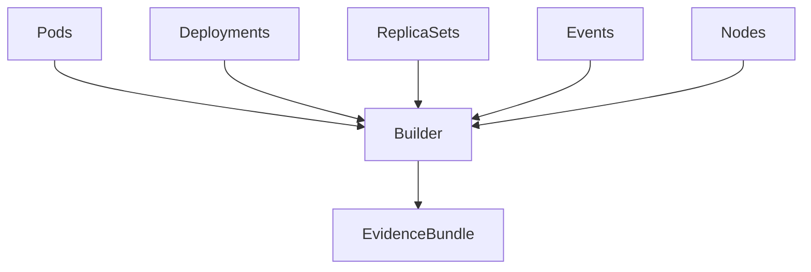
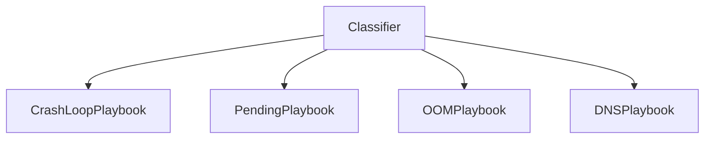
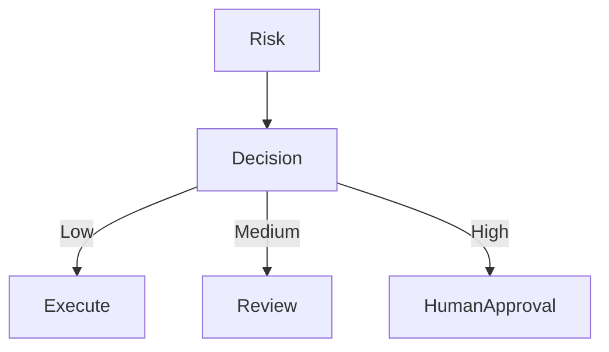
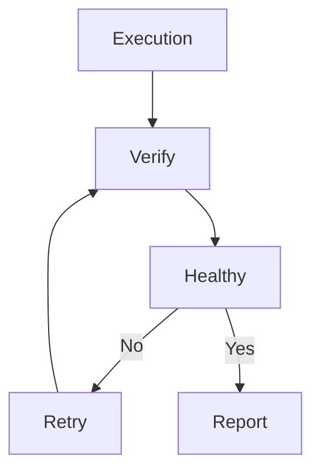
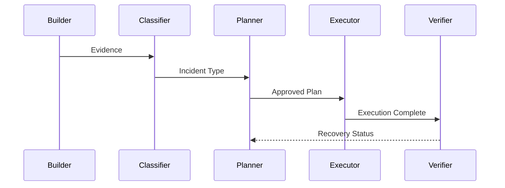

````markdown
# 🤖 AI Agents

AI-SRE is built as a collection of specialized AI agents orchestrated using **LangGraph**.

Instead of relying on one large prompt that performs every task, the platform decomposes incident response into independent agents, each responsible for a single stage of the investigation lifecycle.

This architecture provides:

- Better reasoning
- Easier debugging
- Higher explainability
- Independent testing
- Reusable components
- Easier maintenance

---

# Agent Ecosystem

```mermaid
flowchart LR

EB["Evidence Builder"]

CLASSIFIER["Incident Classifier"]

PLAYBOOK["Playbook Engine"]

REASON["Reasoning Agent"]

PLAN["Planning Agent"]

RISK["Risk Assessment"]

APPROVAL["Approval Agent"]

EXECUTION["Execution Agent"]

VERIFY["Verification Agent"]

REPORT["Report Generator"]

EB --> CLASSIFIER

CLASSIFIER --> PLAYBOOK

PLAYBOOK --> REASON

REASON --> PLAN

PLAN --> RISK

RISK --> APPROVAL

APPROVAL --> EXECUTION

EXECUTION --> VERIFY

VERIFY --> REPORT
```



---

# Agent Design Philosophy

Every agent follows the same design principles.

- Single responsibility
- Stateless execution
- Shared graph state
- Structured input/output
- Explainable reasoning
- Easily replaceable

Each agent reads from the shared LangGraph state, enriches it, and returns structured data for downstream agents.

---

# Shared Investigation State



No agent owns the entire workflow.

Instead, each contributes to the shared investigation state.

---

# Evidence Builder

## Responsibility

Collect Kubernetes evidence required for investigation.

---

### Inputs

- Cluster
- Namespace
- Pod
- Deployment

---

### Collects

- Pods
- Deployments
- ReplicaSets
- Events
- Services
- ConfigMaps
- Secrets (metadata only)
- PVCs
- Nodes

---

### Output

```yaml
EvidenceBundle
```

containing all collected Kubernetes resources.

---

### Mermaid



---

# Incident Classifier

## Responsibility

Determine which failure category best matches the collected evidence.

---

### Possible Outputs

- CrashLoopBackOff
- Pending
- OOMKilled
- ImagePullBackOff
- DNS Failure
- Storage Failure
- API Failure
- Unknown

---

### Output Example

```yaml
incident_type: CrashLoopBackOff
confidence: 0.94
```

---

# Playbook Engine

## Responsibility

Select the investigation strategy.

Instead of collecting everything, each incident type has a dedicated playbook.

---

Example

CrashLoopBackOff

↓

Collect Logs

↓

Restart Count

↓

Probe Configuration

↓

Exit Codes

---

Pending

↓

Scheduler Events

↓

Node Capacity

↓

Taints

↓

Affinity

---

The playbook controls which collectors execute.

---



---

# Reasoning Agent

The most important AI component.

## Responsibility

Determine

- Root Cause
- Supporting Evidence
- Confidence
- Investigation Summary

---

Inputs

- Evidence Bundle
- Incident Type
- Playbook
- Historical Incidents

---

Outputs

```yaml
root_cause:
confidence:
reasoning:
supporting_evidence:
```

---

The Reasoning Agent never executes remediation.

Its only responsibility is diagnosis.

---

# Planning Agent

## Responsibility

Transform diagnosis into an executable remediation plan.

---

Produces

- Recommended Actions
- kubectl Commands
- Rollback Strategy
- Operational Notes
- Estimated Impact

---

Example

```yaml
steps:

- rollout restart deployment

- verify rollout

- verify pods
```

---

# Risk Assessment Agent

Every remediation is evaluated before execution.

---

Risk Categories

| Level | Description |
|--------|-------------|
| Low | Safe automation |
| Medium | Review recommended |
| High | Human approval |
| Critical | Manual execution only |

---

Factors

- Deletes resources?
- Updates Deployments?
- Changes Secrets?
- Cluster-wide impact?
- Stateful workload?

---

# Approval Agent

Responsible for determining whether execution can proceed.

---

Decision Tree



---

Outputs

```yaml
approved: true

reason:
```

---

# Execution Agent

Receives an approved remediation plan.

Responsible for:

- Restart Deployment
- Delete Pod
- Rollback Deployment
- Scale Deployment
- Patch Resources

Execution is deterministic.

No AI reasoning occurs during execution.

---

# Verification Agent

Confirms that remediation actually solved the incident.

Checks include

- Deployment Ready
- Desired Replicas
- Updated Replicas
- Pods Running
- CrashLoopBackOff
- Pending Pods
- Probe Status

---

Verification retries until

- Success
- Timeout

---



---

# Report Generator

Produces a complete operational report.

Includes

- Incident Summary
- Root Cause
- Commands Executed
- Verification Results
- Lessons Learned

---

# Agent Collaboration



---

# Why Multiple Agents?

Using many small agents instead of one large LLM prompt provides:

✅ Better reasoning

✅ Easier debugging

✅ Smaller prompts

✅ Lower token usage

✅ Independent testing

✅ Easier prompt engineering

✅ Better maintainability

---

# Extending AI-SRE

Adding a new capability usually requires only one new agent or playbook.

Examples

- Security Investigation Agent

- Cost Optimization Agent

- Network Diagnostics Agent

- Service Mesh Agent

- GPU Cluster Agent

- Chaos Engineering Agent

The LangGraph architecture allows these capabilities to be added without redesigning the rest of the workflow.

---

# Summary

AI-SRE follows a modular multi-agent architecture where every agent performs one well-defined responsibility.

Rather than building one large autonomous AI, the platform coordinates multiple specialized agents to investigate incidents, generate safe remediation plans, execute approved actions, verify recovery, and preserve operational knowledge for future investigations.
````
