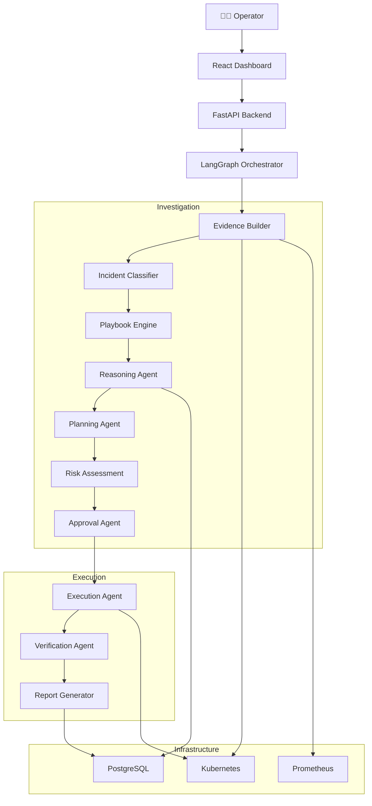
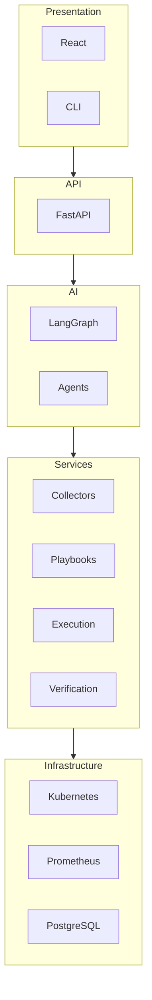
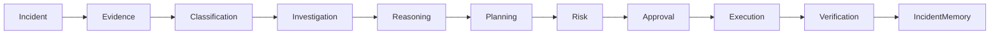
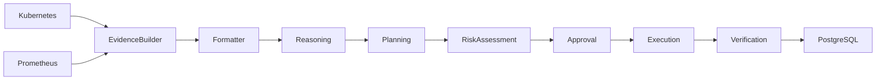
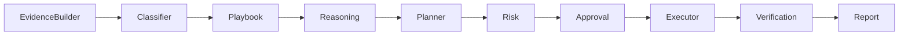

````markdown
# 🏗️ System Architecture

AI-SRE follows a modular, agent-based architecture that separates **investigation**, **decision making**, **execution**, and **verification**.

Instead of relying on static automation scripts, AI-SRE models incident response as a **stateful graph** using **LangGraph**, allowing the system to adapt its investigation based on the evidence collected.

---

# Design Philosophy

The architecture is built around one simple principle:

> **Think before you act.**

Traditional automation systems often execute predefined commands immediately after detecting an alert.

AI-SRE instead follows this sequence:

1. Understand the incident
2. Collect evidence
3. Reason about the evidence
4. Generate a remediation plan
5. Evaluate operational risk
6. Obtain approval (if required)
7. Execute the remediation
8. Verify recovery
9. Learn from the incident

This separation dramatically improves safety, explainability, and auditability.

---

# High-Level Architecture



---

# Component Responsibilities

| Component | Responsibility |
|------------|----------------|
| React | Operator dashboard |
| FastAPI | REST API and orchestration entry point |
| LangGraph | Workflow orchestration |
| Evidence Builder | Collects Kubernetes evidence |
| Incident Classifier | Detects incident category |
| Playbook Engine | Chooses investigation strategy |
| Reasoning Agent | Determines root cause |
| Planning Agent | Generates remediation |
| Risk Assessment | Evaluates operational impact |
| Approval Agent | Determines execution policy |
| Execution Agent | Executes Kubernetes operations |
| Verification Agent | Confirms successful recovery |
| PostgreSQL | Stores investigations and execution history |

---

# Layered Architecture



---

# Incident Lifecycle



Every incident follows the same high-level lifecycle, while the internal investigation adapts depending on the incident type.

---

# Investigation vs Execution

One of AI-SRE's core design decisions is separating investigation from execution.

| Investigation | Execution |
|---------------|-----------|
| Read-only | Read & Write |
| Builds evidence | Applies remediation |
| Uses AI reasoning | Uses deterministic tooling |
| No cluster modifications | Modifies Kubernetes resources |
| Produces remediation plan | Executes approved plan |
| Safe to rerun | Requires safeguards |

This separation ensures that diagnosis can be repeated without affecting production systems.

---

# Data Flow



---

# Agent Collaboration

Unlike traditional automation systems where a single component performs every task, AI-SRE assigns one responsibility to each agent.



Each agent receives structured input from the previous stage and produces structured output for the next stage.

This modular architecture makes the platform easier to maintain, test, and extend.

---

# Why LangGraph?

LangGraph is used because incident response is **stateful**.

Production investigations require:

- Conditional execution
- Retry logic
- Human approval
- Dynamic evidence collection
- Persistent state
- Long-running workflows

A graph-based workflow engine naturally models these requirements better than linear pipelines.

---

# External Integrations

| System | Purpose |
|---------|----------|
| Kubernetes API | Cluster state and execution |
| Prometheus | Metrics collection |
| PostgreSQL | Investigation persistence |
| Docker | Containerization |
| React | User interface |

---

# What's Next?

The next document explains the complete investigation pipeline in detail.

➡️ **Continue with:** `docs/investigation.md`
````
