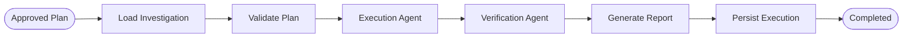
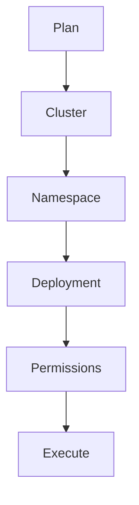
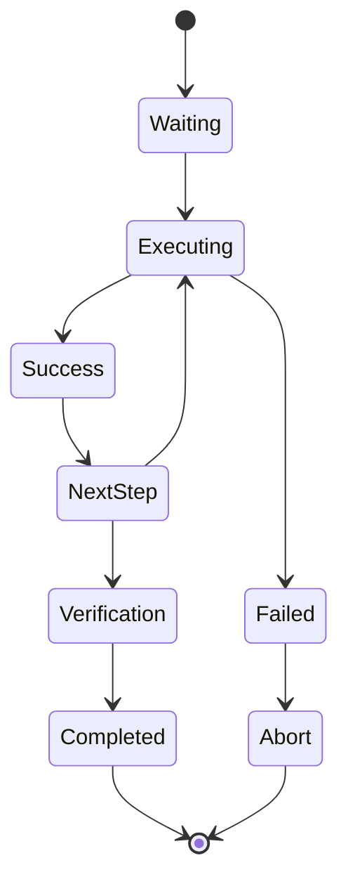
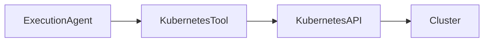
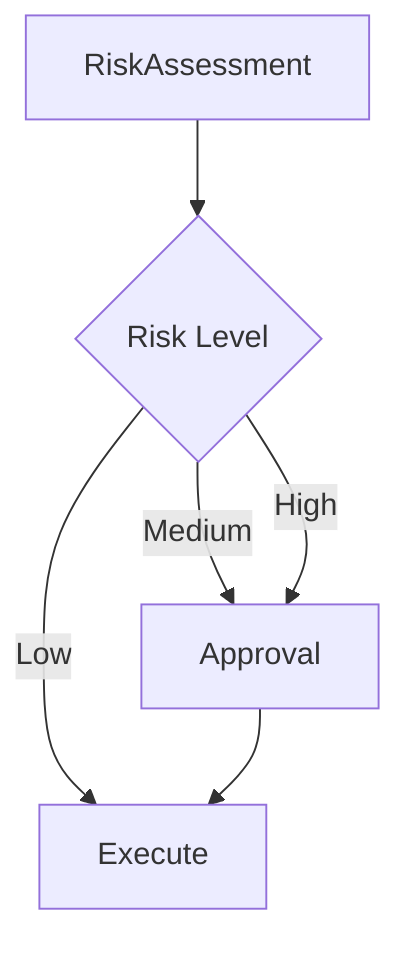
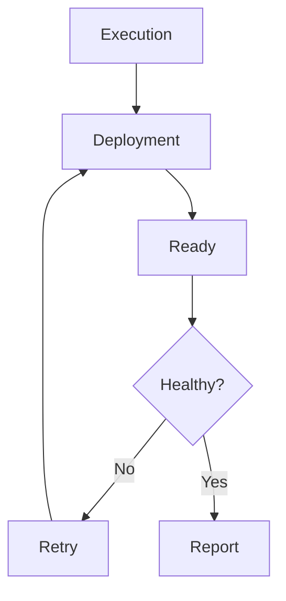

````markdown
# ⚙️ Execution Workflow

The Investigation Workflow determines **what should be done**.

The Execution Workflow determines **how it should be done safely**.

Unlike investigation, execution directly interacts with the Kubernetes cluster by applying approved remediation plans, verifying system health, and recording every action for auditing.

---

# Execution Philosophy

AI-SRE follows one fundamental rule:

> **Never execute before understanding.**

Every execution originates from a completed investigation.

This guarantees that remediation is:

- Explainable
- Auditable
- Risk Assessed
- Approved (when required)
- Verifiable

---

# Complete Execution Pipeline



---

# Execution Responsibilities

The execution workflow performs five major tasks.

| Stage | Responsibility |
|--------|----------------|
| Validation | Verify remediation plan integrity |
| Execution | Apply Kubernetes operations |
| Verification | Confirm cluster recovery |
| Reporting | Generate execution summary |
| Persistence | Store execution history |

---

# Loading the Investigation

Execution begins by loading the completed investigation.

The workflow retrieves:

- Incident details
- Root cause
- Evidence bundle
- Approved remediation plan
- Risk level
- Approval status

Execution never performs additional reasoning.

It strictly follows the approved plan.

---

# Plan Validation

Before executing any action, AI-SRE validates the remediation plan.

Validation includes:

- Cluster exists
- Namespace exists
- Deployment exists
- Required permissions available
- Target resources reachable
- Plan not expired

If validation fails, execution terminates immediately.

---

# Validation Workflow



---

# Execution Agent

The Execution Agent applies remediation actions using deterministic Kubernetes tooling.

Typical operations include:

- Restart Deployment
- Scale Deployment
- Delete Pod
- Rollout Restart
- Rollback Deployment
- Patch Resources
- Restart StatefulSet

Every action is executed independently.

If any step fails, execution stops immediately.

---

# Execution State Machine



---

# Kubernetes Tool Layer

The Execution Agent never invokes shell commands directly.

Instead, every operation passes through a dedicated Kubernetes Tool Layer.

Responsibilities include:

- Loading kubeconfig
- Selecting target cluster
- Executing Kubernetes API calls
- Capturing responses
- Handling retries
- Recording execution metadata

This abstraction simplifies testing while supporting multiple clusters.

---

# Tool Architecture



---

# Risk Assessment

Every remediation plan includes a predefined risk level.

| Risk | Examples | Behaviour |
|------|----------|-----------|
| Low | Restart Pod | Execute Automatically |
| Medium | Scale Deployment | Optional Approval |
| High | Rollback Production | Mandatory Approval |
| Critical | Delete Resources | Explicit Human Confirmation |

Execution never bypasses the assigned policy.

---

# Approval Workflow



---

# Verification Agent

Successful command execution does **not** guarantee incident resolution.

The Verification Agent continuously evaluates deployment health until either:

- Recovery succeeds
- Retry limit exceeded

---

# Verification Checks

The Verification Agent validates:

- Deployment Available
- Desired Replicas
- Updated Replicas
- Ready Pods
- Running Containers
- Probe Status
- CrashLoopBackOff
- Pending Pods
- Rollout Status

Only when all required checks pass is the incident considered resolved.

---

# Verification Workflow



---

# Retry Strategy

Production deployments require time to stabilize.

Instead of failing immediately, AI-SRE retries verification.

Typical retry policy:

| Property | Example |
|-----------|---------|
| Attempts | 5 |
| Delay | 15 seconds |
| Strategy | Exponential Backoff |

This prevents false failures during rolling deployments.

---

# Rollback Support

If execution fails midway, AI-SRE can trigger rollback procedures.

Rollback strategies include:

- Deployment Rollback
- Restore Previous Replica Count
- Restore Previous Image
- Restore Previous Configuration

Rollback support depends on the remediation type.

---

# Execution Report

Every execution generates a structured report.

## Incident

- Cluster
- Namespace
- Deployment
- Incident Type

---

## Root Cause

The diagnosis produced during investigation.

---

## Actions

- Commands Executed
- Execution Duration
- Success / Failure
- Rollback Performed

---

## Verification

- Health Status
- Verification Attempts
- Final Result

---

## Summary

A human-readable operational explanation describing:

- What happened
- Why it happened
- What was executed
- Whether recovery succeeded
- Remaining recommendations

---

# Persistence

Execution history is permanently stored.

Stored information includes:

- Investigation ID
- Execution ID
- Commands Executed
- Verification Results
- Operator Approval
- Rollback Information
- Execution Duration
- Final Outcome

This enables complete operational auditing.

---

# Multi-Cluster Execution

Each execution is isolated to the originating cluster.

The Execution Agent automatically loads:

- Correct kubeconfig
- Cluster credentials
- Namespace
- Context

This prevents accidental cross-cluster operations.

---

# Safety Guarantees

AI-SRE enforces several safety mechanisms before modifying production systems.

✅ Approved remediation only

✅ Risk-based execution

✅ Human approval

✅ Verification after execution

✅ Automatic auditing

✅ Complete execution history

---

# What's Next?

The next document explains the internal AI agents that power AI-SRE, including:

- Evidence Builder
- Incident Classifier
- Reasoning Agent
- Planning Agent
- Risk Assessment Agent
- Approval Agent
- Execution Agent
- Verification Agent

➡️ Continue with **`docs/agents.md`**
````
