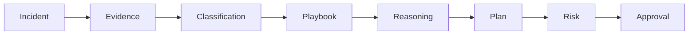
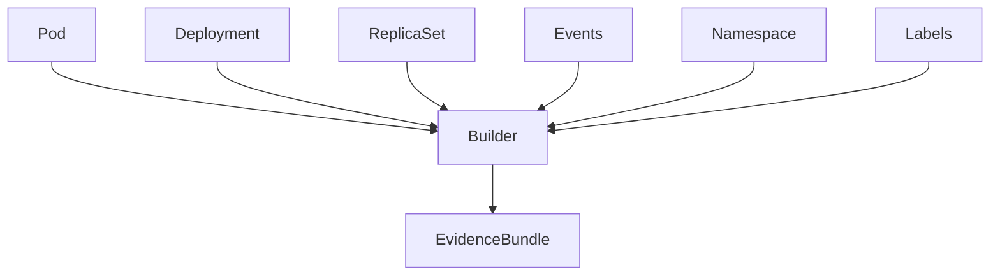
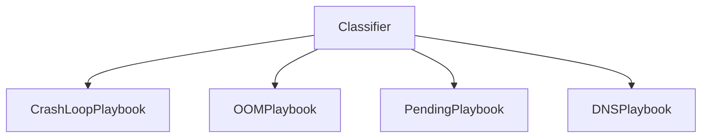
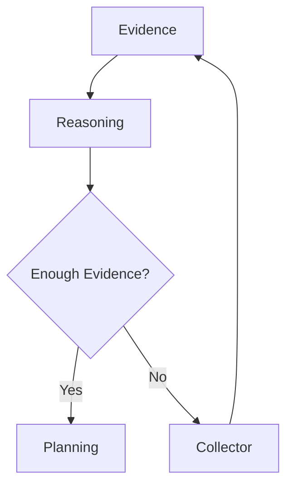

````markdown
# 🔍 Investigation Workflow

The Investigation Workflow is the intelligence core of AI-SRE.

Unlike traditional monitoring systems that simply collect metrics or trigger alerts, AI-SRE actively investigates production incidents by gathering evidence, selecting an appropriate investigation strategy, reasoning over the collected information, and generating an explainable remediation plan.

> **This workflow never modifies the Kubernetes cluster.**
>
> Its sole responsibility is to understand the incident and recommend the safest recovery strategy.

---

# Investigation Goals

Every investigation attempts to answer five questions:

1. **What happened?**
2. **Why did it happen?**
3. **How confident are we?**
4. **What should be done?**
5. **Is the proposed action safe?**

Only after these questions are answered does AI-SRE proceed to execution.

---

# Complete Investigation Pipeline

```mermaid
flowchart LR

START([Incident])

A[Load Incident Context]

B[Evidence Builder]

C[Incident Classifier]

D[Playbook Engine]

E[Adaptive Evidence Collection]

F[Evidence Formatter]

G[Reasoning Agent]

H[Planning Agent]

I[Risk Assessment]

J[Approval Decision]

K[Persist Investigation]

END([Execution Workflow])

START --> A
A --> B
B --> C
C --> D
D --> E
E --> F
F --> G
G --> H
H --> I
I --> J
J --> K
K --> END
```



---

# Investigation State

Throughout the workflow, LangGraph maintains a shared investigation state.



Each agent reads from the shared state, enriches it, and passes it to the next stage.

This approach eliminates duplicated API calls and enables stateful reasoning across the entire investigation.

---

# Stage 1 — Load Incident Context

Every investigation begins with a minimal incident description.

Typical inputs include:

- Cluster name
- Namespace
- Deployment
- Pod
- Alert source
- Incident timestamp

Example:

```yaml
cluster: production
namespace: payments
deployment: payment-service
pod: payment-service-54db8
incident_type: CrashLoopBackOff
```

The investigation context uniquely identifies the affected workload before evidence collection begins.

---

# Stage 2 — Evidence Builder

The Evidence Builder is responsible for constructing an operational snapshot of the affected workload.

It acts as the primary interface between AI-SRE and Kubernetes.

Initially, only lightweight evidence is collected.

Examples include:

- Pod
- Deployment
- ReplicaSet
- Namespace
- Events
- Labels
- Annotations
- Container status

The purpose of this stage is to provide enough information for incident classification without collecting unnecessary resources.

---

## Evidence Builder Architecture



The output of this stage is a structured evidence bundle shared with downstream agents.

---

# Stage 3 — Incident Classification

Not every incident should follow the same investigation strategy.

AI-SRE first determines the most probable failure category.

Supported categories include:

| Incident | Description |
|-----------|-------------|
| CrashLoopBackOff | Repeated container crashes |
| OOMKilled | Memory exhaustion |
| Pending Pods | Scheduling failures |
| ImagePullBackOff | Image retrieval failure |
| Failed Readiness Probe | Service unavailable |
| Failed Liveness Probe | Container restart loop |
| DNS Failure | Cluster DNS issues |
| Storage Failure | Persistent volume problems |
| API Server Failure | Kubernetes control plane |
| etcd Failure | Cluster state issues |

Incident classification determines which playbook should be executed.

---

# Stage 4 — Playbook Engine

Each incident category has its own investigation strategy.

Instead of collecting every Kubernetes resource, AI-SRE only gathers information relevant to the detected incident.

For example:

## CrashLoopBackOff

Collect:

- Previous logs
- Restart history
- Exit code
- Probe configuration
- ReplicaSet history

---

## Pending Pods

Collect:

- Scheduler events
- Node capacity
- Taints
- Tolerations
- Affinity
- Resource availability

---

## OOMKilled

Collect:

- Memory limits
- Memory requests
- Prometheus memory metrics
- Previous OOM events

---

## DNS Failure

Collect:

- CoreDNS logs
- Services
- Endpoints
- Network policies
- DNS configuration

---

# Playbook Selection



This design makes AI-SRE highly extensible.

Adding support for a new incident only requires implementing a new playbook.

---

# Stage 5 — Adaptive Evidence Collection

One of AI-SRE's key innovations is adaptive investigation.

Instead of collecting everything up front, the Reasoning Agent determines whether additional evidence is required.



This dramatically reduces:

- Kubernetes API calls
- Prompt size
- Investigation latency

while improving reasoning quality.

---

# Stage 6 — Evidence Formatter

Raw Kubernetes objects contain a significant amount of metadata that is irrelevant for AI reasoning.

The formatter transforms collected resources into compact, structured documents.

Responsibilities include:

- Removing unnecessary metadata
- Normalizing Kubernetes resources
- Preserving operational context
- Compressing prompt size
- Standardizing collector output

The result is optimized for LLM consumption.

---

# Investigation Artifacts

Each completed investigation produces:

| Artifact | Purpose |
|-----------|----------|
| Evidence Bundle | Operational snapshot |
| Incident Classification | Failure category |
| Investigation Playbook | Collection strategy |
| Root Cause | Diagnosis |
| Confidence Score | AI certainty |
| Remediation Plan | Recovery strategy |
| Risk Level | Execution safety |

These artifacts are persisted and reused during future investigations.

---

# Why Adaptive Investigation?

Traditional systems often collect every available metric regardless of relevance.

AI-SRE instead behaves like an experienced SRE:

1. Gather initial evidence.
2. Form a hypothesis.
3. Request additional evidence only if required.
4. Refine the hypothesis.
5. Produce a diagnosis.

This mirrors how human operators investigate complex production incidents while minimizing unnecessary API calls and reducing reasoning latency.

---

# What's Next?

Once the investigation produces a validated remediation plan, control passes to the **Execution Workflow**, where AI-SRE safely applies the approved recovery actions and verifies that the cluster has returned to a healthy state.

➡️ **Continue with:** `docs/execution.md`
````
